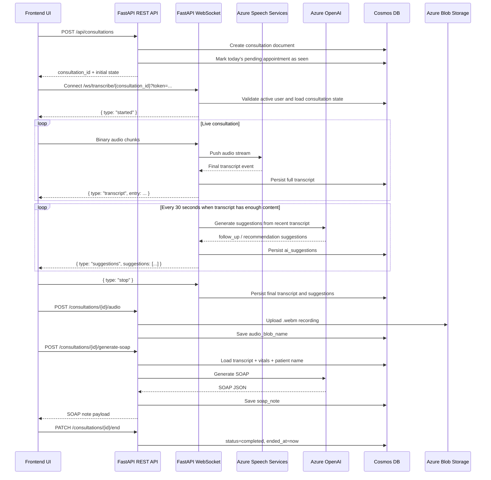

# Consultation Lifecycle And Storage Flow

## Purpose

This document explains how the consultation flow works in the current backend implementation, from the moment a doctor starts a consultation to live transcription, AI suggestions, SOAP note generation, audio storage, and final persistence.

The description below is based on the code paths in the API router, WebSocket handler, consultation service, transcription service, AI service, Cosmos DB access layer, and audio storage service.

## Main Components

- FastAPI REST API: starts and ends consultations, stores SOAP notes, stores audio metadata, and serves audio replay links.
- FastAPI WebSocket: receives live audio chunks and pushes live transcript and suggestion updates back to the client.
- Azure Speech Services: performs real-time diarized transcription when configured.
- Azure OpenAI: generates live consultation suggestions and SOAP notes.
- Azure Cosmos DB: stores the consultation record and related clinical state.
- Azure Blob Storage: stores the recorded consultation audio file.

## Core Data Stores

### Cosmos DB containers

- `consultations`
  Partition key: `/patient_id`
  Stores the active consultation state, transcript, AI suggestions, SOAP note, timestamps, and audio blob reference.

- `patients`
  Partition key: `/facility_id`
  Used to look up patient details such as the patient name during SOAP generation.

- `appointments`
  Partition key: `/facility_id`
  Used when a consultation starts to mark the first matching pending appointment for that patient as `seen`.

- `users`
  Partition key: `/facility_id`
  Used by the WebSocket layer to validate that the connecting user exists and is active.

### Blob Storage

- Container name comes from `AZURE_STORAGE_CONTAINER_NAME`.
- Each consultation recording is stored as:

```text
audio/{facility_id}/{consultation_id}.webm
```

## End-To-End Flow

### 1. Doctor starts the consultation

The consultation starts with:

```http
POST /api/consultations
```

Request body:

```json
{
  "patient_id": "...",
  "vitals": {
    "blood_pressure": "120/80",
    "temperature": 37.0
  }
}
```

What the backend does:

1. Resolves the current authenticated doctor from JWT-protected dependencies.
2. Looks up the facility name from the `facilities` container.
3. Checks whether the doctor already has an `in_progress` consultation.
4. Creates a new consultation document with:
   - `status = in_progress`
   - `started_at`
   - `vitals`
   - empty `transcript`
   - empty `ai_suggestions`
   - empty `soap_note`
   - empty `doctor_notes`
5. Saves that document to the `consultations` container.
6. Looks for the patient's first pending appointment for today and marks it as `seen`.

### 2. Frontend opens the live transcription WebSocket

The frontend then connects to:

```text
GET /ws/transcribe/{consultation_id}?token={access_token}
```

Before the connection is accepted, the backend:

1. Extracts and validates the JWT from the query string.
2. Confirms the token is an access token.
3. Reads the user from the `users` container using `user_id` and `facility_id`.
4. Rejects the connection if the user is missing or inactive.

After acceptance, the client sends a control message:

```json
{
  "type": "start",
  "patient_id": "..."
}
```

On `start`, the backend:

1. Loads the consultation from Cosmos DB.
2. Rehydrates any previously stored `transcript` and `ai_suggestions`.
   This supports reconnect scenarios.
3. Creates a `TranscriptionSession`.
4. Starts a background task that attempts AI suggestion generation every 30 seconds.
5. Returns a WebSocket message:

```json
{
  "type": "started"
}
```

### 3. Live audio streaming and transcription

Once the session is started, the client streams binary audio frames over the same WebSocket.

Expected audio format:

- 16kHz
- 16-bit
- mono PCM

The transcription service uses `ConversationTranscriber` with a `PushAudioInputStream`.

Important implementation details:

- Speech recognition language is set to `en-US`.
- Intermediate diarization is enabled.
- The service attempts to label speakers neutrally as `Speaker 1`, `Speaker 2`, and so on.
- The system does not try to definitively map diarized speakers to `doctor` or `patient` in code.

For each final transcription event returned by Azure Speech:

1. A transcript entry is built:

```json
{
  "speaker": "Guest-1",
  "speaker_label": "Speaker 1",
  "text": "Describe the pain for me.",
  "timestamp": "2026-04-07T10:00:00+00:00"
}
```

2. The entry is appended to the in-memory transcript list for that socket session.
3. The entry is sent immediately to the client as:

```json
{
  "type": "transcript",
  "entry": {
    "speaker": "Guest-1",
    "speaker_label": "Speaker 1",
    "text": "Describe the pain for me.",
    "timestamp": "2026-04-07T10:00:00+00:00"
  }
}
```

4. The full transcript array is persisted back to the consultation document in Cosmos DB.

That means the consultation record is updated progressively during the consultation, not only at the end.

### 4. Live AI suggestions during the consultation

While the consultation is ongoing, a background task runs every 30 seconds.

Suggestion generation only runs when there are at least 3 transcript entries.

What the AI service uses as input:

- the last 10 transcript entries
- all previously generated suggestions, so the model is prompted not to repeat them

What Azure OpenAI returns:

- `follow_up` suggestions for questions the doctor may want to ask
- `recommendation` suggestions for possible next clinical actions

Response shape from the AI layer:

```json
{
  "suggestions": [
    {
      "type": "follow_up",
      "text": "Ask whether the headache worsens with light exposure."
    },
    {
      "type": "recommendation",
      "text": "Consider documenting any recent medication changes."
    }
  ]
}
```

The backend then converts them into persisted suggestion objects:

```json
{
  "type": "follow_up",
  "text": "Ask whether the headache worsens with light exposure.",
  "generated_at": "2026-04-07T10:00:30+00:00",
  "used": false
}
```

Those suggestions are:

1. Appended to the in-memory `all_suggestions` list.
2. Sent to the client over WebSocket as:

```json
{
  "type": "suggestions",
  "suggestions": [
    {
      "type": "follow_up",
      "text": "Ask whether the headache worsens with light exposure.",
      "generated_at": "2026-04-07T10:00:30+00:00",
      "used": false
    }
  ]
}
```

3. Persisted to the consultation document under `ai_suggestions`.

### 5. Stopping the live consultation stream

The client stops the live session by sending:

```json
{
  "type": "stop"
}
```

The WebSocket cleanup path then:

1. Cancels the periodic suggestion background task.
2. Stops the Azure Speech transcription session.
3. Persists the final transcript list.
4. Persists the final suggestions list.

If the socket drops unexpectedly, the same cleanup path still attempts to store the latest transcript and suggestions.

### 6. Uploading the recorded audio

The WebSocket is only responsible for live streaming and live AI feedback.
The final recorded audio file is uploaded separately over HTTP after recording stops.

Endpoint:

```http
POST /api/consultations/{consultation_id}/audio?patient_id={patient_id}
```

What happens on upload:

1. The backend verifies the consultation exists.
2. Reads the full uploaded file into memory.
3. Ensures the Blob Storage container exists.
4. Uploads the file to Blob Storage as:

```text
audio/{facility_id}/{consultation_id}.webm
```

5. Saves the blob path into the consultation document as `audio_blob_name`.
6. Updates `updated_at` on the consultation document.

Later, when replay is needed, the backend exposes:

```http
GET /api/consultations/{consultation_id}/audio-url?patient_id={patient_id}
```

That endpoint generates a time-limited SAS URL valid for 1 hour.

### 7. Generating the SOAP note

SOAP generation is a separate explicit backend action, not something the WebSocket performs automatically.

Endpoint:

```http
POST /api/consultations/{consultation_id}/generate-soap?patient_id={patient_id}
```

What the backend does:

1. Loads the consultation from Cosmos DB.
2. Verifies the consultation has a transcript.
3. Looks up the patient's name from the `patients` container.
4. Sends the following context to Azure OpenAI:
   - full consultation transcript
   - vitals from the consultation document
   - patient name
5. Uses a strict JSON schema when the configured Azure OpenAI model supports structured outputs.
6. Expects four fields back:
   - `subjective`
   - `objective`
   - `assessment`
   - `plan`

The generated SOAP object is first produced in this shape:

```json
{
  "subjective": "...",
  "objective": "...",
  "assessment": "...",
  "plan": "...",
  "is_draft": true,
  "edited_by_doctor": false,
  "generated_at": "2026-04-07T10:10:00+00:00"
}
```

It is then persisted through the generic SOAP save function.

### 8. Saving or editing the SOAP note

SOAP notes can also be edited and saved explicitly through:

```http
PUT /api/consultations/{consultation_id}/soap?patient_id={patient_id}
```

Persisted SOAP storage sits under the consultation document in the `soap_note` field.

Important current implementation detail:

- The shared `save_soap_note()` function forces `is_draft = false` and `edited_by_doctor = true` before storage.
- Because `generate-soap` also uses that same save function, the generated SOAP note is immediately stored as non-draft and doctor-edited in the current code path.

So the persisted SOAP state after generation looks closer to this:

```json
{
  "subjective": "...",
  "objective": "...",
  "assessment": "...",
  "plan": "...",
  "is_draft": false,
  "edited_by_doctor": true,
  "generated_at": "2026-04-07T10:10:00+00:00"
}
```

### 9. Ending the consultation record

When the consultation is formally ended, the backend receives:

```http
PATCH /api/consultations/{consultation_id}/end?patient_id={patient_id}
```

This updates the consultation document by setting:

- `status = completed`
- `ended_at = now`
- `updated_at = now`

## Sequence Diagram



## What Is Stored In The Consultation Document

Below is the practical shape of the consultation record as it evolves.

```json
{
  "id": "consultation_uuid",
  "patient_id": "patient_uuid",
  "facility_id": "facility_uuid",
  "facility_name": "General Hospital",
  "doctor_id": "doctor_uuid",
  "doctor_name": "Dr. Example",
  "status": "completed",
  "started_at": "2026-04-07T10:00:00+00:00",
  "ended_at": "2026-04-07T10:25:00+00:00",
  "vitals": {
    "blood_pressure": "120/80",
    "temperature": 37.0
  },
  "transcript": [
    {
      "speaker": "Guest-1",
      "speaker_label": "Speaker 1",
      "text": "Describe the pain for me.",
      "timestamp": "2026-04-07T10:00:00+00:00"
    }
  ],
  "ai_suggestions": [
    {
      "type": "follow_up",
      "text": "Ask whether the pain radiates.",
      "generated_at": "2026-04-07T10:00:30+00:00",
      "used": false
    }
  ],
  "soap_note": {
    "subjective": "...",
    "objective": "...",
    "assessment": "...",
    "plan": "...",
    "is_draft": false,
    "edited_by_doctor": true,
    "generated_at": "2026-04-07T10:10:00+00:00"
  },
  "doctor_notes": "",
  "audio_blob_name": "audio/facility_uuid/consultation_uuid.webm",
  "created_at": "2026-04-07T10:00:00+00:00",
  "updated_at": "2026-04-07T10:25:00+00:00",
  "type": "consultation"
}
```

## Persistence Summary By Stage

| Stage | Storage target | Fields updated |
|---|---|---|
| Consultation created | Cosmos DB `consultations` | patient, doctor, facility, vitals, status, timestamps, empty transcript/suggestions/SOAP |
| Appointment linked | Cosmos DB `appointments` | matching pending appointment set to `seen` |
| Each transcript event | Cosmos DB `consultations` | `transcript`, `updated_at` |
| Suggestion generation | Cosmos DB `consultations` | `ai_suggestions`, `updated_at` |
| Audio upload | Blob Storage and Cosmos DB | blob written to storage, `audio_blob_name`, `updated_at` |
| SOAP generation/save | Cosmos DB `consultations` | `soap_note`, `updated_at` |
| Consultation end | Cosmos DB `consultations` | `status`, `ended_at`, `updated_at` |

## Operational Notes

### Reconnect behavior

If the client reconnects during a consultation, the WebSocket start flow reloads:

- existing transcript entries
- existing AI suggestions

That allows the client to continue from already-persisted state.

### Graceful degradation

- If Azure Speech is not configured or the SDK is unavailable, the transcription session still starts in passthrough mode, but there will be no actual cloud transcription.
- If Azure OpenAI is not configured, live suggestions return an empty list instead of breaking the consultation flow.
- SOAP generation is stricter: if Azure OpenAI is not configured, the generate SOAP endpoint raises a service error rather than silently returning empty content.

### Data ownership model

The consultation document is the central clinical session record.
Everything related to the consultation accumulates into that one record except the binary audio file itself, which lives in Blob Storage and is referenced by `audio_blob_name`.

## In Plain Terms

The live consultation path works like this:

1. Create one consultation record in Cosmos DB.
2. Stream audio through WebSocket.
3. Convert speech to structured transcript entries in near real time.
4. Persist the transcript continuously during the session.
5. Periodically ask Azure OpenAI for follow-up suggestions and persist those too.
6. Upload the final audio file to Blob Storage after recording stops.
7. Generate a SOAP note from the stored transcript and vitals.
8. Save the SOAP note back into the same consultation record.
9. Mark the consultation completed when the session is closed.

This means the consultation record becomes the single source of truth for the clinical encounter, while Blob Storage holds the replayable media artifact.